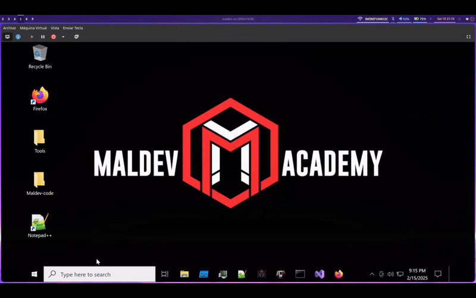

# Guide on Importing Windows 10 Pre-built VMs into virt-manager

This guide explains how to import pre-built Windows 10 virtual machines into virt-manager using QEMU/KVM on Linux systems. The process covers converting disk images, configuring UEFI boot, and optimizing performance.

## Prerequisites

Before starting, ensure you have these packages installed on your system:

```bash
# For Arch Linux
sudo pacman -S qemu-full virt-manager libvirt ebtables dnsmasq edk2-ovmf

# For Ubuntu/Debian
sudo apt install qemu-kvm virt-manager libvirt-daemon-system virtio-win ovmf
```

## Converting the Virtual Disk

Usually pre-buit VM's come into various different formats but .ova are designed to work with most hypervisors and follow the Open Virtualization Format (OVF) standard. They typically offer better compatibility when importing into KVM/QEMU:

1. Extract the OVA archive:
```bash
tar xf windows10.ova
```
This will extract several files:
- `.ovf` file: Contains the VM configuration
- `.vmdk` or `.vhd` file: The actual virtual disk
- `.mf` file: Contains checksums
- Additional metadata files

Then convert the extracted disk to the QEMU format:

```bash
# Convert VMDK to QCOW2
qemu-img convert -O qcow2 source_disk.vmdk windows10.qcow2

# For VHD/VHDX files
qemu-img convert -O qcow2 source_disk.vhd windows10.qcow2
```

## Creating the Virtual Machine

1. Open virt-manager and click "Create New Virtual Machine"
2. Select "Import existing disk image"
3. Browse and select your converted QCOW2 file
4. Choose "Windows 10" as the operating system
5. Configure memory and CPU resources as needed

## UEFI Configuration

Most modern Windows 10 installations use UEFI. Configure it properly:

1. In virt-manager's VM settings, go to "Overview"
2. Set "Firmware" to UEFI by selecting one of these options:
   - `/usr/share/edk2/x64/OVMF_CODE.4m.fd` (Standard UEFI)
   - `/usr/share/edk2/x64/OVMF_CODE.secboot.4m.fd` (UEFI with Secure Boot)

If the VM doesn't boot properly, check the boot entry in the UEFI menu (accessible by pressing ESC during boot) and ensure it points to `/EFI/Microsoft/Boot/bootmgfw.efi`.


## Performance Optimization

After successful import, optimize your VM:

1. Install Spice Guest Tools:
   # Download VirtIO drivers
   https://www.spice-space.org/download/windows/spice-guest-tools/spice-guest-tools-latest.exe
   
   Add this ISO to your VM and install:
   - VirtIO SCSI drivers
   - VirtIO Network drivers
   - QEMU Guest Agent
   - SPICE Guest Tools


<div align="center">

</div>


## Notes

- Always back up your virtual disk before conversion
- Keep the original disk image until you verify everything works
- Monitor performance and adjust resources as needed

## References

- [QEMU Documentation](https://www.qemu.org/docs/master/)
- [libvirt Documentation](https://libvirt.org/docs.html)
- [VirtIO Documentation](https://docs.oasis-open.org/virtio/virtio/v1.1/virtio-v1.1.html)
